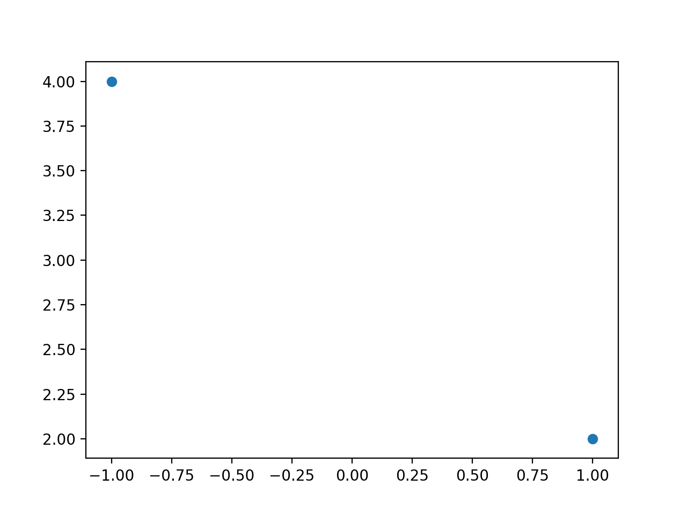

# Matplotlib

## Descripción
*[Matplotlib](https://matplotlib.org/)* es una librería de Python que permite graficar en 2D. Permite generar diferentes tipos de gráficas como:
- Histogramás
- Gráficas de Disperción
- Gráficas de Barras

Una de las caracteristicas más notables de Matplotlib es que permite realizar este tipo de gráficas en pocas lineas.

## Instalación

La instalación se hace mediante el comando `pip` desde línea de comandos, debe de estar en modo Administrador para poder realizar dicha instalación.
```bash
pip install matplotlib
```


## Uso

Lo primero es cargar la libreria, en este caso podemos asignarles un aleas para poderlo usar más adelante en el codigo.
```python
import matplotlib.pyplot as plt
```

Si lo que queremos es generar una Gráfica de Dispersión de los puntos _(1,2)_ y _(-1,4)_ entonces necesitamos hacer lo siguiente:
```python
plt.scatter([1,-1], [2,4])
```

El primer parámetro son los valores en X, mientras que el segundo son los valores en Y. La función `scatter` tiene los siguientes parámetros:
```python
matplotlib.pyplot.scatter(x, y, s=None, c=None, marker=None, cmap=None, norm=None, vmin=None, vmax=None, alpha=None, linewidths=None, verts=None, edgecolors=None, *, plotnonfinite=False, data=None, **kwargs)
```

Ya para poder ver la gráfica la hacemos mediante el parámetro:
```python
plt.show()
```

La imagen que se muestra es la siguiente:


