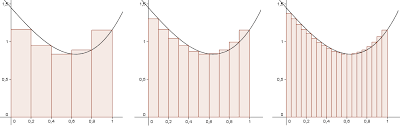
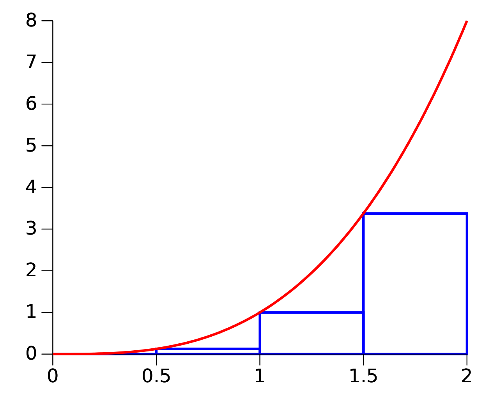

# Sumatoria de Riemann

## Descripción
La sumatoria de _Riemann_ es una aproximación al valor de una integral definida mediante una serie finitia.

La suma se realiza generando una serie de Rectangulos que asemejan a la región que se quiere calcular y calculando el area de los mismos.

Debido a lo anteriormente mencionado, este método permite obtener una aproximación al área que se quiere medir,  ya que como se puede ver en la imagen la región generada por los rectangulos difiere a la del área que se esta tratando de calcular.  Para disminuir el error se pueden usar una mayor cantidad de rectangulos.

### Metodología

El intervalo  se divide en *n* subintervalos, cada uno de la misma longitud,  .
La aproximación de la función se va haciendo para cada uno de los rectangulos con base    y altura   con  

## Archivos
* **SumatoriaRiemann_1.py** : se creo la función _riemann_ la cual recibe los parámetros de: _li_ limite inferior, _ls_ limite superior y _elementos_ que es la cantidad de subintervalos. Se busca el tamaño del incremento, sumando a una variable dicho incremento en un ciclo hasta que se llega al limite superior.
* **SumatoriaRiemann_2.py** : se creo la función _riemann_ la cual recibe los parámetros de: _li_ limite inferior, _ls_ limite superior y _elementos_ que es la cantidad de subintervalos. Se hace un ciclo basado en el número de subintervalos a calcular su área, se usa la formula de  para calcular la altura del rectangulo.
* **SumatoriaRiemann_2.py** : se crearon dos funciones:
1.- La función _seq_ la cual recibe los parámetros de: _li_ limite inferior, _ls_ limite superior y _elementos_ que es la cantidad de subintervalos. Es una función generadora que permite obtener los valores de los subintervalos.
2.-  la función _riemann_ la cual recibe los parámetros de: _li_ limite inferior, _ls_ limite superior y _elementos_ que es la cantidad de subintervalos y _funcion_. Se hace un ciclo basado en los subintervalos generados por la función _seq_ y se evaluan en la _funcion_ usando la instrucción _eval_.
